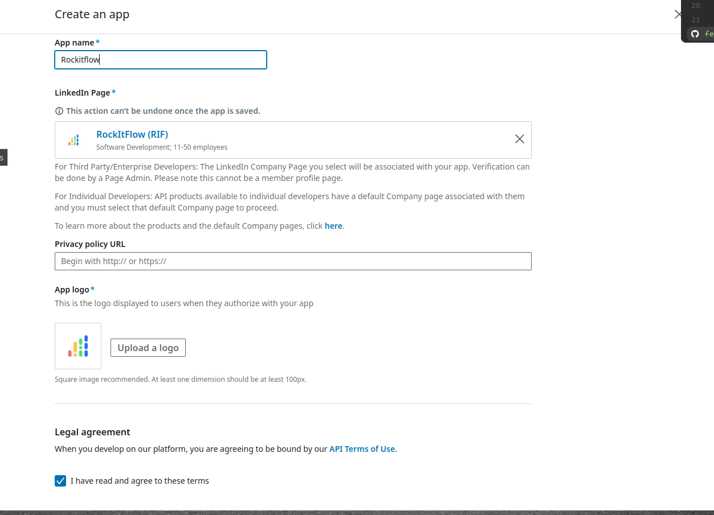
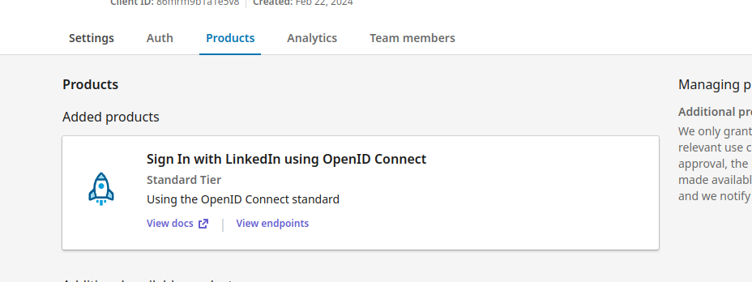
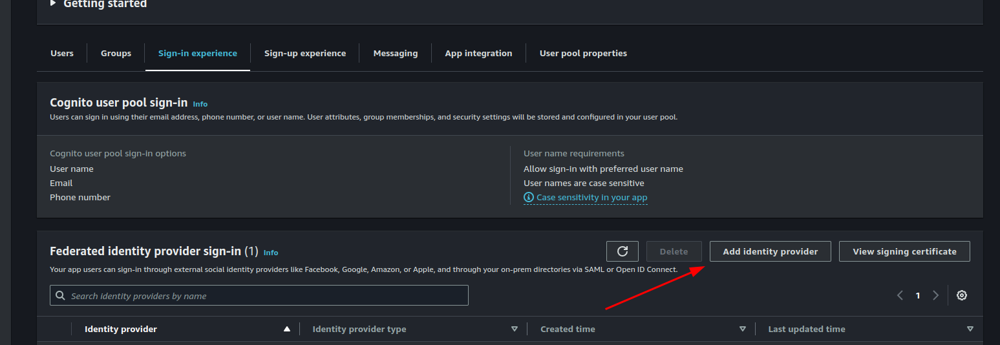
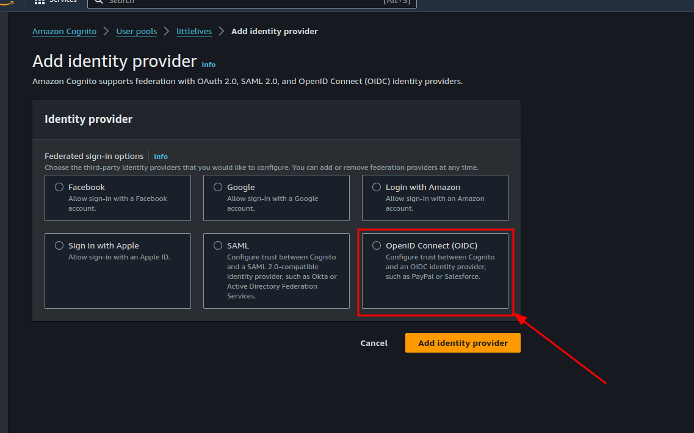
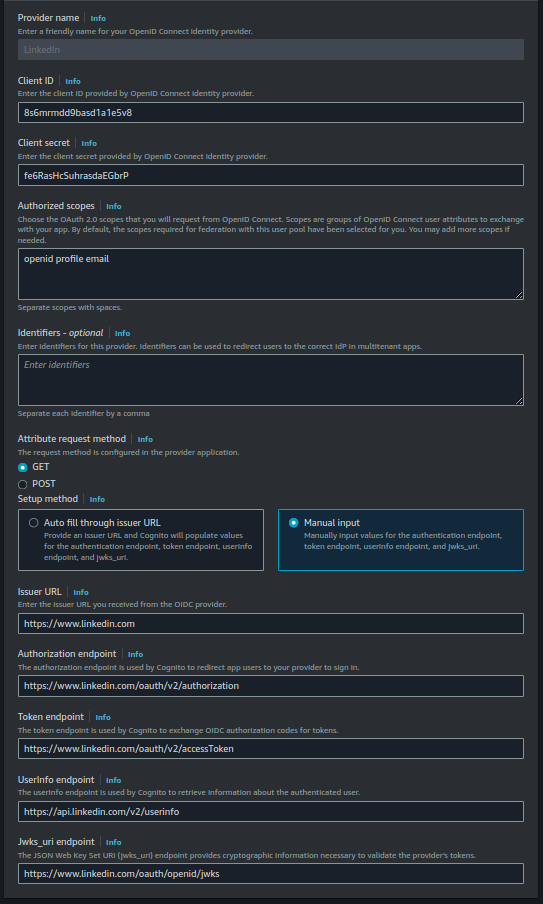
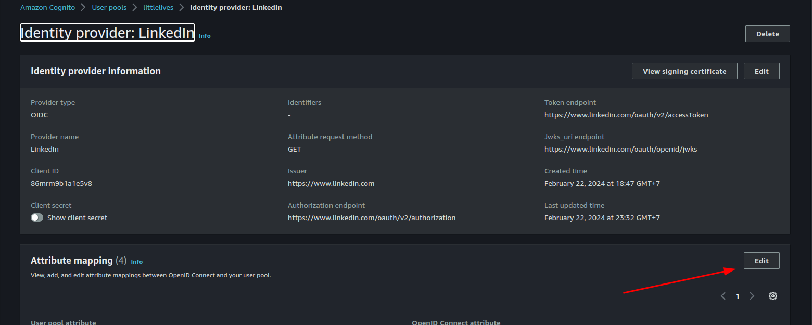
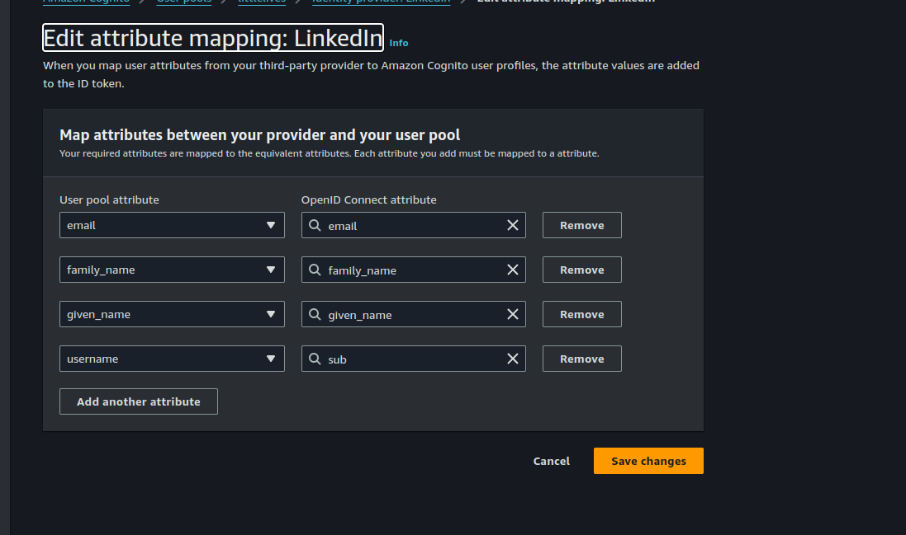

# Setup Login with LinkedIn

## Create LinkedIn App

### Create App

Go to [LinkedIn Developer Console](https://www.linkedin.com/developers/apps) and create a new app.

### Create LinkedIn Sign In Product

- Select product `Sign In with LinkedIn using OpenID Connect` and request for access.

## Create Cognito User Pool

### Add new Identity Provider

Cognito AWS does not support LinkedIn as an identity provider. So, we need to create a custom identity provider.

Using OpenID Connect, we can create a custom identity provider.

Config `LinkedIn` as an identity provider.

`Client ID` and `Client Secret` are obtained from LinkedIn App.

Map data from LinkedIn to Cognito User Pool.

# Reference

- [LinkedIn OpenID Connect](https://learn.microsoft.com/en-us/linkedin/consumer/integrations/self-serve/sign-in-with-linkedin-v2?context=linkedin%2Fconsumer%2Fcontext)
- [https://repost.aws/knowledge-center/cognito-linkedin-auth0-social-idp](https://repost.aws/knowledge-center/cognito-linkedin-auth0-social-idp)
